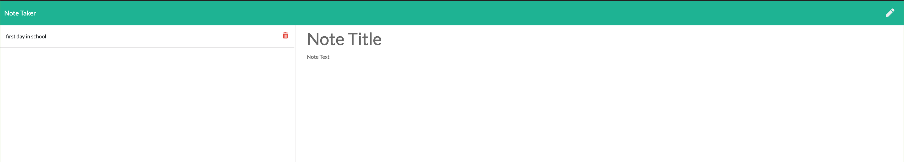

# Note-Taker

## Description

This is an application that can be use to write, save, and delete notes.
This is built with express.js as backend,
html5, css3, and js as frontend 
and db.JSON file as database.

## Heroku deployed link

[heroku link](https://take-note1.herokuapp.com/)

## project image

